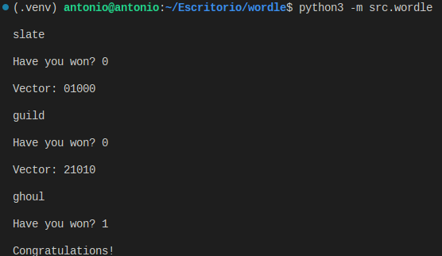

# Introduction

This repo contains the code for playing Wordle with a heuristic that consists on selecting the word that gives us more information. It is based on this [video](https://www.youtube.com/watch?v=v68zYyaEmEA) of 3Blue1Brown, which explains all the maths behind.

Basically what it does is:
1. Calculate the entropy of each word.
2. Introduce the word with the highest entropy.
3. If we win, it is finished. Otherwise, update the list of possible remaining words and go to 1.

The entropy of a word $w$ is calculated as

$$E(w)=-\sum_{v\in V}p_w(v)\log_2(p_w(v))$$

where $V$ is the set of all possible output vectors $v$. The probability of a vector $v$ introducing the word $w$ is calculated as the number of times we would obtain $v$ introducing all possible remaining words if $w$ is the correct word divided by the total number of possible remaining words.

# Results

After simulating all possible games (2315), it resolves them with a mean of 3.58 attempts and a standard deviation of 0.82 attempts. More precisely, in the following table the first row represents the number of attempts and the second row how many games have been won in that attempts.

| Attempts to win | 1 |  2  |  3  |  4  |  5  | 6  | 7 | 8 |
| --------------- | - | --- | --- | --- | --- | -- | - | - |
| Number of times | 1 | 146 | 959 | 978 | 188 | 34 | 6 | 3 |

# How to play

Just execute in the terminal:

    python -m src.wordle

# Example

